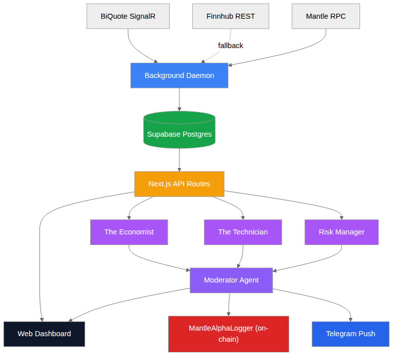

<div align="center">
  
  <h1>🔮 HamaFX-Ai: Mantle Alpha Agent</h1>
  <p><strong>Mantle Turing Test Hackathon 2026</strong> | <em>Track 2: AI Alpha & Data</em></p>

  [](https://nextjs.org/)
  [](https://mantle.xyz/)
  [](https://sdk.vercel.ai/)
  [](https://supabase.com/)
  [](https://opensource.org/licenses/MIT)
</div>

<br/>

HamaFX-Ai is an **autonomous, on-chain AI Alpha Agent** built specifically for the Mantle Network ecosystem. 

Moving beyond simple heuristic trading bots, HamaFX-Ai utilizes a **Multi-Agent LLM Committee** to actively monitor the Mantle blockchain, analyze DeFi liquidity shifts, detect whale movements, and synthesize fundamental data. To ensure absolute trust and transparency, **every generated alpha signal is permanently logged to the Mantle Sepolia blockchain** via our ERC-8004 Agent Identity contract.

---

## ✨ Premium Features

### 🤖 Multi-Agent Consensus Architecture
Why trust one AI when you can consult a committee? When generating an alpha signal, the system spawns three specialized sub-agents in parallel:
- 📊 **The Economist:** Evaluates macro fundamentals, tokenomics, and market sentiment.
- 📉 **The Technician:** Analyzes real-time DEX depth, volume spikes, and historical price action.
- 🛡️ **The Risk Manager:** Audits smart contract concentration risk and liquidity fragmentation.
A final **Moderator Agent** synthesizes these three distinct viewpoints into a cohesive `A-F` grade and a `1-10` confidence score.

### 🔗 Tamper-Proof On-Chain Identity
AI predictions are only as good as their verifiable track record. 
- The agent holds its own private key and acts as the owner of the `MantleAlphaLogger` smart contract.
- Upon reaching a consensus, the agent automatically executes a transaction on Mantle Sepolia to permanently engrave its prediction (`direction`, `confidence`, `summary`, and `asset`).
- Users can click directly from our premium UI to view the exact transaction on **MantleScan**.

### 🐋 Live Data Ingestion Worker
A dedicated Node.js background worker utilizes Mantle RPC nodes to continuously scan for high-value on-chain events. 
- Detects massive token transfers (Whale Alerts) and calculates their USD value dynamically.
- Monitors top Mantle DeFi protocols (like Merchant Moe and Agni Finance) for TVL anomalies.
- Caches this data in a high-performance Supabase PostgreSQL database for the AI committee to query instantly.

### 📱 Instant Telegram Push Routing
High-conviction alpha is time-sensitive. If the committee generates a signal with a Confidence Score ≥ 7 or an A/B Grade, the system bypasses the web UI and instantly fires a rich Telegram Push Notification directly to the user's device, complete with actionable insights and the blockchain verification link.

---

## 🏗 System Architecture



---

## 📜 Smart Contract Identity

The AI Agent acts as the autonomous owner of the `MantleAlphaLogger` contract. 
- **Network:** Mantle Sepolia Testnet
- **Chain ID:** `5003`
- **Contract Address:** `0x6D29F763dF73A0C23D837aDAFF67DE68B48a92F9`
- **Verification:** [View Live on MantleScan ↗](https://sepolia.mantlescan.xyz/address/0x6D29F763dF73A0C23D837aDAFF67DE68B48a92F9)

---

## 🚀 Quickstart & Deployment

This project uses a modern **Turborepo** monorepo structure.

### 1. Install Dependencies
```bash
# We use pnpm for strict workspace management
pnpm install
```

### 2. Environment Configuration
Copy the environment templates:
```bash
cp .env.example .env.local
cp contracts/.env.example contracts/.env
```
Ensure you provide your LLM API keys (Google Vertex/Gemini), Supabase credentials, and Telegram Bot tokens in `.env.local`.

### 3. Database Migrations
Push the Drizzle ORM schemas to your Supabase instance:
```bash
cd packages/db
pnpm run migrate:apply
```

### 4. Agent Wallet & Contract Deployment
The agent requires a funded Mantle Sepolia wallet to deploy its contract and pay for signal transactions.
1. Claim testnet MNT from the [Mantle Faucet](https://faucet.testnet.mantle.xyz/) to the agent's wallet address (`0xF73BA9f4Fc94F4B648B10FBBc6dE9a708519D3D0`).
2. Run our automated deployment script from the root directory:
```bash
./deploy-agent.sh
```
*This script will compile the Solidity contracts via Hardhat, deploy to Mantle, and auto-inject the resulting contract address into your `.env.local`.*

### 5. Launch the Matrix
Boot up the Next.js frontend and the background worker simultaneously:
```bash
pnpm dev
```
Navigate to [http://localhost:3000](http://localhost:3000) to access the **Agent Dashboard** and interact with the **On-Chain Signal Feed**.

### 6. Workspace Commands

```bash
pnpm dev          # Start all apps (web + worker) in dev mode
pnpm build        # Build all packages and apps
pnpm lint         # Run ESLint across all packages
pnpm typecheck    # TypeScript type-check all packages
pnpm test         # Run all test suites
```

### 7. Vercel Deployment

The web app is pre-configured for Vercel deployment (see `.vercel/repo.json`):

```bash
npx vercel deploy --prod --cwd apps/web
```

Environment variables are managed through the Vercel dashboard. Ensure all
vars from `.env.example` are set before deploying.

## 🛠 Troubleshooting

| Problem | Solution |
|---------|----------|
| `pnpm install` fails with lockfile mismatch | Run `pnpm install --no-frozen-lockfile` to update |
| Database migrations fail | Verify `POSTGRES_URL` in `.env.local` and run `pnpm run migrate:apply` from `packages/db` |
| Agent wallet has no MNT | Claim testnet tokens from [Mantle Faucet](https://faucet.testnet.mantle.xyz/) |
| TypeScript errors after pulling | Run `pnpm install` and `pnpm typecheck` |
| Vercel build fails with `frozen-lockfile` | Commit the updated `pnpm-lock.yaml` or use `--no-frozen-lockfile` in Vercel project settings |
| Worker not connecting to SignalR | Check `BIQUOTE_API_KEY` is set and valid |
| On-chain scan returning no events | Verify `MANTLE_RPC_URL` points to a synced Mantle RPC endpoint |

---
<div align="center">
  <i>Built with 🖤 for the Mantle ecosystem.</i>
</div>
