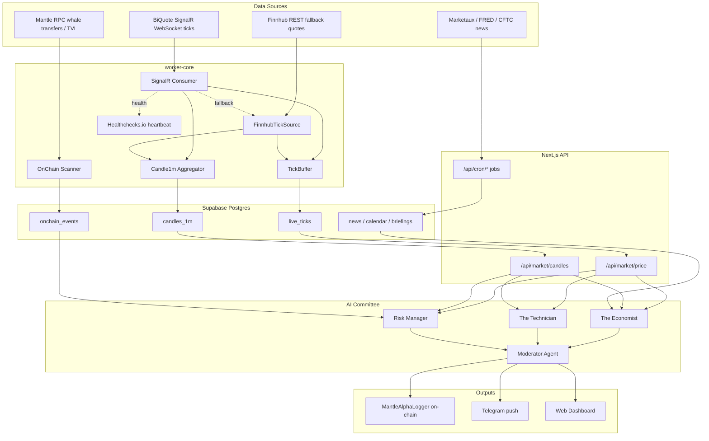

<div align="center">
  
  <h1>🔮 HamaFX-Ai: Autonomous Alpha Agent for Mantle</h1>

  [](https://nextjs.org/)
  [](https://mantle.xyz/)
  [](https://sdk.vercel.ai/)
  [](https://supabase.com/)
  [](https://opensource.org/licenses/MIT)
</div>

<br/>

HamaFX-Ai is an **autonomous, on-chain AI agent** purpose-built for the Mantle Network. It continuously monitors the blockchain, analyzes DeFi liquidity dynamics, detects whale movements, and synthesizes market data — then logs every generated signal on-chain for verifiable transparency.

---

## ✨ Features

### 🤖 Multi-Agent Consensus
Alpha signals are produced by a committee of three specialized LLM sub-agents running in parallel:
- **The Economist** — evaluates macro fundamentals, tokenomics, and sentiment
- **The Technician** — analyzes DEX depth, volume, and price action
- **The Risk Manager** — audits concentration risk and liquidity fragmentation

A **Moderator Agent** reconciles the three viewpoints into a single `A-F` grade and `1-10` confidence score.

### 🔗 On-Chain Verifiability
The agent holds its own private key and acts as the owner of the `MantleAlphaLogger` contract on Mantle Sepolia. Every alpha signal is permanently engraved on-chain, producing a verifiable record that can be inspected directly on MantleScan.

### 🐋 Live Data Pipeline
A persistent background daemon continuously ingests:
- Real-time price ticks via **BiQuote SignalR** WebSocket
- On-chain whale transfers and DeFi TVL changes via **Mantle RPC**
- REST fallback via **Finnhub** when primary sources are silent

All data is cached in **Supabase PostgreSQL** for low-latency access by the AI committee.

### 📱 Instant Telegram Notifications
High-conviction signals (confidence ≥ 7 or grade A/B) bypass the web UI and fire a rich Telegram push notification with actionable insights and the on-chain verification link.

### 📊 Interactive Dashboard
A full-featured Next.js frontend with:
- Real-time price charts (lightweight-charts)
- Multi-chart layouts with sync'd crosshairs
- AI chat interface with tool execution
- On-chain signal feed with MantleScan deep links
- Economic calendar and news feed

---

## 🏗 Architecture



The monorepo is organized as a **Turborepo** with two deploy targets:

| Package | Purpose |
|---------|---------|
| `apps/web` | Next.js 15 frontend + API routes |
| `packages/worker-core` | Persistent daemon (ticks, candles, on-chain scan) |
| `packages/shared` | Zod schemas, symbol definitions, shared types |
| `packages/db` | Drizzle ORM schema + Postgres client |
| `packages/data` | Market data providers with failover |
| `packages/indicators` | Technical indicators (RSI, MACD, Bollinger, ATR, etc.) |
| `packages/ai` | AI tools, prompts, agent orchestration |
| `packages/web3` | On-chain reading + event scanning |
| `packages/config` | Shared TypeScript, ESLint configs |
| `apps/worker` | Legacy standalone worker (includes MT5 bridge) |

On **Vercel**, only the web app runs (daemon disabled automatically). For self-hosted deployment, a single **Docker** image bundles both the web server and background daemon.

---

## 🚀 Quickstart

### Prerequisites
- Node.js >= 20.11
- pnpm >= 9.0
- A Supabase project (Postgres)
- API keys for your chosen LLM provider (Google Gemini, etc.)
- A Mantle Sepolia wallet funded with testnet MNT

### 1. Install
```bash
pnpm install
```

### 2. Configure Environment
```bash
cp .env.example .env.local
```
Fill in your LLM keys, Supabase credentials, and any other service tokens.

### 3. Database
```bash
cd packages/db && pnpm run migrate:apply
```

### 4. Agent Wallet
Fund the agent wallet with Mantle Sepolia testnet MNT, then deploy the logging contract:
```bash
./deploy-agent.sh
```

### 5. Local Development
```bash
pnpm dev
```
Opens the dashboard at [http://localhost:3000](http://localhost:3000).

### Workspace Commands
```bash
pnpm build        # Build all packages
pnpm typecheck    # TypeScript type-check across all packages
pnpm test         # Run all test suites
pnpm lint         # ESLint across all packages
```

---

## 🐳 Docker Deployment

Build and run the unified image (web server + background daemon):
```bash
docker build -t hamafx-web .
docker run -p 3000:3000 --env-file .env.local hamafx-web
```

The daemon processes start automatically when not running on Vercel (checked via the `VERCEL` environment variable).

---

## 📜 Smart Contract

| Property | Value |
|----------|-------|
| Network | Mantle Sepolia Testnet |
| Chain ID | `5003` |
| Contract | `0x6D29F763dF73A0C23D837aDAFF67DE68B48a92F9` |
| Explorer | [MantleScan ↗](https://sepolia.mantlescan.xyz/address/0x6D29F763dF73A0C23D837aDAFF67DE68B48a92F9) |

---

## 🔧 Troubleshooting

| Problem | Solution |
|---------|----------|
| `pnpm install` fails with lockfile mismatch | Run `pnpm install --no-frozen-lockfile` |
| Database migrations fail | Check `POSTGRES_URL` in `.env.local` |
| Agent wallet has no MNT | Claim from [Mantle Faucet](https://faucet.testnet.mantle.xyz/) |
| TypeScript errors after pulling | Run `pnpm install && pnpm typecheck` |
| Daemon not collecting ticks | Verify `BIQUOTE_HUB_URL` and `FINNHUB_API_KEY` are set |
| On-chain scan returns nothing | Ensure `MANTLE_RPC_URL` points to a synced RPC endpoint |

---

## License

MIT
